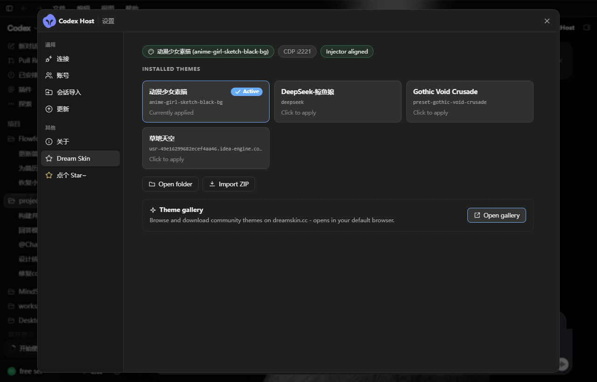

# CodexSkinHub

<p align="center">
  <strong>给 codexhost 启动的 Codex 一套可独立分发的主题管理能力。</strong><br>
  主题热切换 · ZIP 导入 · 主题库 · 应用内设置面板 · 全自动安装引导
</p>

<p align="center">
  <a href="#安装">安装</a> ·
  <a href="#命令一览">命令</a> ·
  <a href="#工作原理">原理</a> ·
  <a href="#常见问题">排障</a>
</p>

<p align="center">
  官方主题库：<a href="https://dreamskin.cc"><strong>DreamSkin.cc</strong></a> ·
  <a href="https://dreamskin.cc/gallery">Gallery</a>
</p>

---

**CodexSkinHub** 把 [Codex Dream Skin](https://github.com/Fei-Away/Codex-Dream-Skin) ×
codex-host 集成中的主题管理能力抽取为独立项目，可单独版本化、分发与升级。

**非侵入式**：不修改 [Codex Dream Skin](https://github.com/Fei-Away/Codex-Dream-Skin)
安装目录，也不改 [@codexhost/cli](https://www.npmjs.com/package/@codexhost/cli)
源码仓库——一切通过运行时补丁完成，由锚点式幂等补丁器施加，上游锚点漂移时**拒绝写入并明确报错**，绝不写脏文件。

<p align="center">
  
</p>
<p align="center"><sub>应用内「Dream Skin」设置面板：状态芯片、主题卡片热切换、Import ZIP / Open folder / Gallery</sub></p>

## 功能

- 🎨 **主题热切换** — `codexskin theme <名称>`，基于 CDP 注入，所有运行中的 Codex 窗口**即时生效，无需重启**
- 📦 **主题 ZIP 导入** — `codexskin import`，原生文件对话框，自动探测嵌套 `theme.json`，按 id 去重新增
- 🖼 **主题库** — `codexskin gallery` 打开 dreamskin.cc/gallery，`codexskin dir` 打开本地主题库
- ⚙️ **应用内设置面板** — CodexHost 设置页出现「Dream Skin」入口：主题卡片即时切换、状态芯片（活动主题 / CDP 端口 / 注入器状态）、Import ZIP、Open folder、Gallery 按钮
- 🩺 **体检** — `codexskin doctor`，一条命令检查引擎 / 主题库 / 垫片 / 守护进程 / 补丁状态
- 🚀 **后台启动** — `codexskin start --background`，脱离终端运行，关掉命令行窗口不影响 Codex 与注入
- 🧰 **全自动安装引导** — `codexskin setup`，全新机器一条命令补齐全部依赖
- 🔄 **四层自愈** — npm 升级覆盖补丁后自动恢复（详见[工作原理](#工作原理)）

## 安装

### 方式一：npm + 全自动引导（推荐）

```cmd
npm install -g codexskin-hub
codexskin setup
```

`codexskin setup` 会自动补齐全新机器需要的一切：

| 步骤 | 缺失时的行为 |
|---|---|
| ① Codex Desktop（微软商店 MSIX 应用） | 尝试 `winget` 自动安装；失败则打开商店页面引导安装（最多重试 3 次） |
| ② `@codexhost/cli`（npm 全局包） | 自动 `npm install -g @codexhost/cli` |
| ③ Codex Dream Skin 引擎 | 从 GitHub Releases 下载最新 `CodexDreamSkin-Setup-*.exe` 并运行安装向导（`--yes` 静默安装） |
| ④ 集成收尾 | 运行时拷贝 + 补丁 + PATH 垫片，最后跑 `codexskin doctor` 体检 |

- 所有下载尊重 `HTTPS_PROXY` 环境变量；
- 加 `--dry-run` 只报告缺什么、不做任何安装；
- 加 `--yes` 跳过确认并静默安装 Dream Skin。

### 方式二：从源码

```cmd
git clone <本仓库> && cd CodexSkinHub
node install.mjs          # 追加 --startup 注册开机自启
```

`install.mjs` 幂等可重复执行：`git pull` 之后重跑一次即完成原地升级。

**前置条件（Windows）**：[Codex Dream Skin](https://github.com/Fei-Away/Codex-Dream-Skin)
（提供注入引擎与主题库）与全局安装的 `@codexhost/cli`。未装 Dream Skin 时安装器会优雅降级（警告 + 跳过补丁，CLI 仍可用），装好后重跑 `codexskin setup` 即可补齐。

## 命令一览

| 命令 | 说明 |
|---|---|
| `codexskin setup [--yes] [--dry-run]` | 引导安装全部前置依赖并完成集成 |
| `codexskin start [--theme <名>] [--background\|-b]` | 启动 codexhost + 注入守护；`--background` 脱离终端运行 |
| `codexskin theme [<名称>]` | 热切换主题 / 列出已装主题 |
| `codexskin import` | 选择主题 ZIP 并导入主题库 |
| `codexskin gallery` / `dir` | 打开在线 Gallery / 本地主题库 |
| `codexskin status` | 查看 endpoint / 注入器 / 活动主题状态 |
| `codexskin inject` | 手动对齐注入器到运行中的 Codex 一次 |
| `codexskin doctor` | 全链路健康检查 |
| `codexskin down` | 停止 supervisor、codexhost 包装进程与注入器 |

## 工作原理

- **注入**：Dream Skin 主题通过 CDP 在运行时注入。注入器 watch 循环轮询活动主题目录指纹，重写 `active-theme` 内文件即可对所有运行中的 Codex 窗口热生效。
- **端口发现**：codexhost 启动 Codex Desktop 时动态选择 CDP 端口，supervisor 通过 ChatGPT.exe 的监听套接字 → `/json/version` 发现真实端点，按需（重）启动注入器。
- **补丁**：`src/patch.mjs` 锚点式幂等补丁器向已安装的 `@codexhost/cli` 的 bin 与 renderer 各插入带 `[codexskin]` 标记的代码块：
  - **bin**：主题命令分发 + `superviseDetached`（启动时自愈拉起 supervisor 守护）；
  - **renderer**：应用内 Dream Skin 设置页载荷。
  锚点漂移时拒绝写入、保持文件原样；`--revert` 可按标记剥离，与官方 0.6.0 stock 文件**字节级一致**。
- **四层自愈**（对抗 `npm update -g @codexhost/cli` 覆盖补丁）：
  1. `codexskin` 命令入口每次执行前静默重打补丁；
  2. PATH 前置目录垫片在转发到真实 bin 前重打补丁；
  3. 开机自启链（`--startup` 注册）自愈；
  4. bin 补丁内的 hook 兜底 spawn supervisor。
- **状态**：运行时状态位于 `%LOCALAPPDATA%\CodexSkinHub`（config、supervisor 状态、日志、导入临时目录）；Dream Skin 引擎与主题库留在 `%LOCALAPPDATA%\CodexDreamSkin` 仅被引用（可通过 `config.json -> dreamSkinRoot` 覆写）。

## 卸载

```cmd
codexskin down
node uninstall.mjs        # 或 npm 卸载时自动执行
npm uninstall -g codexskin-hub
```

补丁会剥离回官方原状，垫片 / 开机项 / 运行时目录一并移除；Dream Skin 安装与主题库不受影响。

## 兼容性

- 操作系统：**Windows 10/11**（引擎为 Windows 专用）
- 已对 codexhost **0.6.0** windows-x64 做字节级验证。上游未来版本移动锚点时，补丁器会**大声失败且不写文件**——运行 `codexskin doctor` 查看漂移详情，并到仓库提 issue 等适配。

## 常见问题

**Q: `npm install -g` 时警告 Dream Skin engine not found？**
正常降级行为。装好 Codex Dream Skin 后重跑 `codexskin setup`，它会自动补齐并应用补丁。

**Q: 更新 codexhost 后主题设置页消失了？**
四层自愈通常会在下次启动时自动恢复。如未恢复，运行 `codexskin doctor` 查看 bin / renderer 补丁状态，或直接 `node src/patch.mjs` 手动重打。

**Q: GitHub 下载超时？**
设置代理环境变量（如 `set HTTPS_PROXY=http://127.0.0.1:7897`）后重跑 `codexskin setup`。

**Q: `codexskin start -b` 之后关了终端，主题还在吗？**
在。后台模式下的 Codex 与 supervisor 均已脱离终端，`codexskin status` 可随时查看，`codexskin down` 一键停止。

## 项目结构

```
src/cli.mjs               CLI + supervisor + CDP 桥（setup/start/theme/import/gallery/status/down/doctor）
src/hook.mjs              被补丁后的 codexhost bin 加载（主题分发 + supervisor 自愈拉起）
src/patch.mjs             锚点式幂等补丁器：apply / status / --revert
src/payload/renderer.js   应用内 Dream Skin 设置页载荷
src/tools/ui-verify.mjs   CDP 截图驱动（UI 验证）
install.mjs / uninstall.mjs
```

## 相关项目

- [Codex Dream Skin](https://github.com/Fei-Away/Codex-Dream-Skin) — 主题引擎与生态（本项目引用其注入器与主题库）
- [@codexhost/cli](https://www.npmjs.com/package/@codexhost/cli) — Codex Desktop 启动器（本项目的补丁目标）

> 非 OpenAI 官方产品。不修改 WindowsApps / app.asar；所有改动均为可剥离的运行时补丁。

## License

[MIT](./LICENSE) © alleyf
